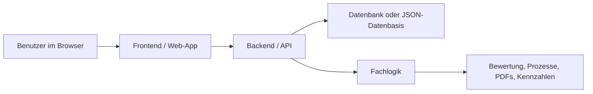

# Hauptdokument: Technische Grundsätze und Struktur der drei DMS-Systeme

Stand: 05.08.2026  
Autor: Lazar Minkov  
Projekt: Dealer-Management-Systeme für Autohäuser  
Repository: `https://github.com/dinero2004/DMS-System.git`

## AI-Assisted Documentation and Co-Development Statement

Dieses Hauptdokument wurde mit Unterstützung von OpenAI Codex (Codex AI) erstellt. Das dazugehörige DMS-Codeprojekt wurde in einem KI-gestützten Co-Development-Prozess konzipiert, analysiert, strukturiert und mitentwickelt. Codex unterstützte insbesondere bei technischer Dokumentationsstruktur, Codeanalyse, Docker-/GitHub-Aufbereitung und branchspezifischer Organisation. Fachliche Zielsetzung, Projektausrichtung, Auswahlentscheidungen, Prüfung und finale Verantwortung liegen beim Projektverfasser Lazar Minkov.

## 1. Zweck dieses Dokuments

Dieses Hauptdokument beschreibt die gemeinsamen technischen Entscheidungen hinter drei webbasierten Dealer-Management-Systemen.

Die drei Systeme verfolgen unterschiedliche Schwerpunkte:

| System | Hauptzweck | Technische Rolle |
| --- | --- | --- |
| ValuPilot DMS | Fahrzeugdaten und Fahrzeugbewertung | Bewertungs-MVP mit erklärbarer Logik |
| DealerOps Command DMS | Operative Autohausprozesse | Größere DMS-Suite mit mehreren Modulen |
| Veloce Dealer OS | Schnelle Datenvisualisierung | Leichtes Dashboard aus JSON-Exportdaten |

## 2. Gemeinsames Architekturprinzip

Alle Systeme folgen demselben Grundgedanken: Ein DMS soll Daten, Prozesse und Benutzeroberfläche so ordnen, dass ein Autohaus damit arbeiten kann, ohne dass die Software selbst unnötig kompliziert wirkt.

Die gemeinsame technische Denkweise lautet:

1. Die Benutzeroberfläche soll fachliche Arbeit sichtbar machen.
2. Die Datenhaltung soll strukturiert und nachvollziehbar bleiben.
3. Backend und Frontend sollen klare Verantwortlichkeiten haben.
4. Docker soll den lokalen Betrieb vereinfachen und die Systeme voneinander trennen.
5. GitHub soll den Entwicklungsstand nachvollziehbar dokumentieren.

## 3. Gesamtstruktur des Workspaces

Die drei Systeme liegen lokal unter:

`/Users/yourFilePath/Documents/DMS_System_DEMO/dealer-management-systems`

Wichtige Ordner:

```text
dealer-management-systems/
  docker-compose.yml
  README.md
  portal/
  valupilot-dms/
  dealerops-command-dms/
  veloce-dms/
  scripts/
```

Der Ordner `portal` dient als gemeinsame Produkt- und Lernseite. Die drei DMS-Systeme sind getrennt umgesetzt, werden aber über eine gemeinsame Docker-Compose-Datei verwaltet.

## 4. Gemeinsames Systembild



## 5. Eingesetzte Technologien im Überblick

| Bereich | Technologie | Eingesetzt in | Zweck |
| --- | --- | --- | --- |
| Frontend | React | ValuPilot, DealerOps | Komponentenbasierte Benutzeroberflächen |
| Frontend-Build | Vite | ValuPilot, DealerOps | Schneller Entwicklungsserver und Produktionsbuild |
| Sprache Frontend | TypeScript | ValuPilot, DealerOps | Typisierte UI-Entwicklung |
| UI-Icons | lucide-react | ValuPilot | Schlichte, konsistente Icons |
| Diagramme | Recharts | DealerOps | Dashboard-Diagramme |
| Mehrsprachigkeit | i18next, react-i18next | DealerOps | DE/EN/FR/IT-Sprachumschaltung |
| Backend | Spring Boot | ValuPilot, DealerOps | REST-API, Geschäftslogik, Datenzugriff |
| Sprache Backend | Java 21 | ValuPilot, DealerOps | Moderne, stabile Backend-Sprache |
| Persistenz | Spring Data JPA | ValuPilot, DealerOps | Repositories und Datenbankzugriff |
| Datenbank | PostgreSQL | ValuPilot, DealerOps | Relationale Datenhaltung |
| Migrationen | Flyway | DealerOps | Versioniertes Datenbankschema |
| PDF-Ausgabe | OpenPDF | DealerOps | Vertrags-, Finanzierungs- und Rechnungsdokumente |
| Leichtes Backend | Node.js HTTP | Veloce | Kleine API ohne Framework |
| Webserver | nginx | React-Container | Auslieferung des gebauten Frontends |
| Betrieb | Docker Compose | Alle Systeme | Gemeinsamer lokaler Start und Isolation |

## 6. Warum diese Technologien gewählt wurden

### React und TypeScript

React eignet sich gut für DMS-Oberflächen, weil ein DMS aus wiederkehrenden UI-Bausteinen besteht: Tabellen, Formulare, Statusanzeigen, Navigation, Detailansichten und Dashboards. TypeScript ergänzt React, weil typische DMS-Daten klar modelliert werden können, etwa Fahrzeuge, Kunden, Rechnungen oder Bewertungen.

Vorteile:

- Komponenten lassen sich wiederverwenden.
- Fachliche Daten können mit TypeScript-Typen beschrieben werden.
- Der Einstieg ist für Webentwicklungsstudierende realistisch.
- Der Stack ist breit dokumentiert und gut in GitHub-Projekten nachvollziehbar.

Nachteile:

- Ohne saubere Struktur kann eine React-Anwendung schnell in große Einzeldateien wachsen.
- Formulare und Datenzustand müssen bewusst geplant werden.
- React löst keine Backend- oder Datenbankfragen; diese müssen separat entworfen werden.

### Vite

Vite wurde gewählt, weil es React-Projekte schnell startet und für Prototypen wenig Konfigurationsaufwand erzeugt. Für ein Diplomprojekt ist das wichtig: Die Entwicklungszeit soll in Fachlogik und Nutzbarkeit fließen, nicht in Build-Konfiguration.

Vorteile:

- Schneller Entwicklungsserver.
- Einfache Skripte wie `npm run dev` und `npm run build`.
- Gut geeignet für React- und TypeScript-Projekte.

Nachteile:

- Vite ist ein Build-Werkzeug, keine vollständige Architektur.
- API-Proxy, Umgebungsvariablen und Deployment müssen trotzdem bewusst konfiguriert werden.

### Spring Boot und Java

Spring Boot wurde für zwei Systeme gewählt, weil ein DMS typische Backend-Aufgaben hat: REST-Endpunkte, Validierung, Datenbankzugriff, Transaktionen, Sicherheit, Konfiguration und teilweise PDF-Erzeugung. Spring Boot bietet dafür einen zusammenhängenden Rahmen.

Vorteile:

- Bewährtes Ökosystem für Web-APIs.
- Gute Integration mit PostgreSQL und JPA.
- Saubere Schichtung über Controller, Services, Repositories und Entities.
- Java 21 ist stabil und für größere Systeme geeignet.

Nachteile:

- Mehr Einstiegshürde als ein kleines Node.js-Skript.
- Zu viele Spring-Konzepte können am Anfang überfordern.
- Für sehr kleine Prototypen kann Spring Boot schwerer wirken als nötig.

### PostgreSQL

PostgreSQL wurde gewählt, weil DMS-Daten relational sind: Ein Kunde kann mehrere Fahrzeuge besitzen; Fahrzeuge können Serviceeinträge, Verkaufsprozesse, Rechnungen oder Bewertungen haben. Eine relationale Datenbank passt gut zu solchen Beziehungen.

Vorteile:

- Starke relationale Modellierung.
- Geeignet für Filter, Joins, Aggregationen und konsistente Transaktionen.
- Realistischer als reine JSON-Dateien, wenn das System wachsen soll.

Nachteile:

- Datenbankmodellierung muss sauber geplant werden.
- Lokaler Betrieb benötigt Datenbankdienst oder Docker.
- Änderungen am Schema benötigen Disziplin.

### Flyway

Flyway wird im DealerOps-System verwendet, um Datenbankänderungen versioniert zu verwalten. Statt Tabellen manuell zu verändern, werden SQL-Migrationen im Repository abgelegt.

Vorteile:

- Datenbankschema wird nachvollziehbar.
- Änderungen sind mit Git versionierbar.
- Mehrere Entwickler können denselben Schema-Stand herstellen.

Nachteile:

- Migrationen müssen sorgfältig nummeriert und nicht nachträglich verändert werden.
- Für sehr frühe Prototypen wirkt es zunächst zusätzlicher Aufwand.

### Docker Compose

Docker Compose verwaltet die Systeme als lokale Containerlandschaft. Dadurch laufen ValuPilot, DealerOps, Veloce und das Portal parallel, ohne dieselben Ports oder Datenbanken zu überschreiben.

Vorteile:

- Reproduzierbarer Start der Systeme.
- Getrennte Netzwerke und Volumes pro System.
- PostgreSQL kann lokal ohne manuelle Installation betrieben werden.

Nachteile:

- Docker Desktop und CLI müssen funktionieren.
- Containerlogs und Volumes müssen verstanden werden.
- Persistente Volumes können alte Daten behalten, was beim Debugging verwirren kann.

## 7. Docker-Verwaltung der drei DMS-Systeme

Die zentrale Datei ist:

`/Users/lazarminkov/Documents/DMS_System_DEMO/dealer-management-systems/docker-compose.yml`

Die Systeme werden dort mit eigenen Services, Ports, Netzwerken und Volumes getrennt:

| System | Web-Port | API-Port | Datenhaltung | Netzwerk | Volume |
| --- | ---: | ---: | --- | --- | --- |
| Portal | 15172 | - | Statische Website | `portal-net` | - |
| ValuPilot | 15173 | 18080 | PostgreSQL auf Host-Port 55432 | `valupilot-net` | `valupilot-db-data` |
| DealerOps | 15174 | 18081 | PostgreSQL auf Host-Port 55433 | `dealerops-net` | `dealerops-db-data` |
| Veloce | 15175 | 15175 | JSON-Datei im Container | `veloce-net` | - |

Start aller Systeme:

```bash
cd /Users/lazarminkov/Documents/DMS_System_DEMO/dealer-management-systems
docker compose up -d
```

Start eines einzelnen Systems:

```bash
docker compose up -d valupilot-web
docker compose up -d dealerops-web
docker compose up -d veloce-web
```

Status prüfen:

```bash
docker compose ps
```

Stoppen:

```bash
docker compose down
```

Stoppen inklusive Datenbank-Volumes:

```bash
docker compose down -v
```

Wichtig: `down -v` löscht die persistenten Datenbankdaten. Für Demos ist das manchmal hilfreich, für echte Daten wäre es gefährlich.

## 8. Docker-Architektur

Für ein ähnliches DMS-Projekt lässt sich folgender Aufbau ableiten:

1. Zuerst den fachlichen Fokus bestimmen: Bewertung, Operations-Suite oder Dashboard.
2. Für ein datenintensives System PostgreSQL einplanen.
3. Backend als REST-API entwerfen.
4. Frontend als eigenständige Browser-App bauen.
5. Für jedes System eigene Ports vergeben.
6. Für jedes System ein eigenes Docker-Netzwerk definieren.
7. Für jede Datenbank ein eigenes Volume definieren.
8. Datenbank-Healthchecks nutzen, bevor die API startet.
9. Frontend im Produktionscontainer über nginx ausliefern.
10. Den Code mit README und Git-Remote dokumentieren.

## 9. GitHub-Ablage

Der lokale Workspace ist mit folgendem Remote verbunden:

```text
origin  https://github.com/dinero2004/DMS-System.git
```

Das bedeutet: Die drei Systeme sind nicht als drei unabhängige Git-Repositories geführt, sondern als Teil eines gemeinsamen Projektrepositories. Für ein Diplomprojekt ist das nachvollziehbar, weil die Systeme denselben Forschungskontext teilen und miteinander verglichen werden.

Vorteile eines gemeinsamen Repositories:

- Ein zentraler Projektstand.
- Gemeinsame Dokumentation.
- Docker-Compose kann alle Systeme aus einem Workspace starten.
- Die Entwicklungsgeschichte bleibt an einem Ort.

Nachteile:

- Das Repository kann größer und unübersichtlicher werden.
- Änderungen an einem System können mit Änderungen an einem anderen System vermischt werden.
- Für spätere produktive Weiterentwicklung wären separate Repositories oder ein sauberer Monorepo-Prozess sinnvoll.

## 10. Designrichtung der drei Systeme

Die Systeme verwenden bewusst unterschiedliche Designrichtungen, weil sie unterschiedliche Zwecke erfüllen.

### ValuPilot DMS

ValuPilot wirkt ruhig, hell und analytisch. Die Farbwelt nutzt helle Flächen, dunkle grüne Navigation und einen warmen Akzent. Das passt zum Bewertungsfokus: Der Benutzer soll Preise, Datenqualität, Marktinformationen und Begründungen konzentriert lesen können.

### DealerOps Command DMS

DealerOps ist dichter und stärker als Arbeitsoberfläche gestaltet. Es nutzt Sidebar-Navigation, Panels, Tabellen, Dashboardflächen, Themes und Glas-/Panel-Effekte. Das passt zu einem operativen System, weil mehrere Aufgaben gleichzeitig sichtbar sein müssen.

### Veloce Dealer OS

Veloce ist bewusst leicht, hell und tabellenorientiert. Es dient als schnelle Sicht auf exportierte Daten. Die Oberfläche ist weniger funktionsreich, dafür schnell verständlich und einfach zu warten.

## 11. Gemeinsame Qualitätsprinzipien

Für alle drei Systeme gelten dieselben Qualitätsprinzipien:

- Sichtbarer Systemstatus: Benutzer sollen erkennen, in welchem Modul oder Zustand sie sich befinden.
- Fachnahe Sprache: Begriffe wie Fahrzeuge, Kunden, Aufträge, Bewertung oder Rechnungen statt interner Technikbegriffe.
- Wiedererkennbare Muster: Sidebar, Tabellen, Karten und Statuschips wiederholen sich.
- Reduktion auf Kernaufgaben: Ein DMS darf reich an Daten sein, aber die Oberfläche soll nicht beliebig wirken.
- Dokumentation im Code und im Repository: Ein anderer Entwickler soll das System starten und erweitern können.

Diese Prinzipien orientieren sich an etablierten Usability-Heuristiken, besonders an Sichtbarkeit des Systemstatus, Konsistenz, Fehlervermeidung, Wiedererkennen statt Erinnern und knapper Hilfe/Dokumentation.

## 12. Empfohlene technische Struktur für ein eigenes DMS

Für ein neues DMS-Projekt auf Basis dieser Arbeit empfiehlt sich folgende Struktur:

```text
dms-project/
  docker-compose.yml
  docs/
  frontend/
    src/
      components/
      pages/
      api/
      types/
  backend/
    src/main/java/...
      config/
      modules/
      shared/
    src/main/resources/
      db/migration/
  README.md
```

Wichtige Regeln:

- Fachmodule nach Geschäftsbereichen strukturieren, nicht nur nach Technik.
- API-Endpunkte stabil benennen, z. B. `/api/v1/cars`.
- Datenbankänderungen versionieren.
- Frontend-Komponenten nicht zu groß werden lassen.
- Docker-Ports dokumentieren.
- Demo-Credentials niemals als Produktionssicherheit betrachten.

## 13. Quellen und Referenzen

React Documentation. 2026. *Quick Start / Learn React*. Verfügbar unter: https://react.dev/learn  
Vite Documentation. 2026. *Getting Started*. Verfügbar unter: https://vite.dev/guide/  
Spring. 2026. *Spring Boot Documentation*. Verfügbar unter: https://docs.spring.io/spring-boot/index.html  
Spring Data. 2026. *Spring Data JPA Reference*. Verfügbar unter: https://docs.spring.io/spring-data/jpa/reference/  
PostgreSQL Global Development Group. 2026. *PostgreSQL Documentation: Tutorial*. Verfügbar unter: https://www.postgresql.org/docs/current/tutorial.html  
Docker. 2026. *Docker Compose Documentation*. Verfügbar unter: https://docs.docker.com/compose/  
Docker. 2026. *Networking in Compose*. Verfügbar unter: https://docs.docker.com/compose/how-tos/networking/  
Docker. 2026. *Volumes*. Verfügbar unter: https://docs.docker.com/engine/storage/volumes/  
Redgate. 2026. *Flyway Migrations*. Verfügbar unter: https://documentation.red-gate.com/fd/migrations-271585107.html  
Node.js. 2026. *HTTP Module Documentation*. Verfügbar unter: https://nodejs.org/api/http.html  
nginx. 2026. *Beginner's Guide*. Verfügbar unter: https://nginx.org/en/docs/beginners_guide.html  
Nielsen, J. 1994/2024. *10 Usability Heuristics for User Interface Design*. Nielsen Norman Group. Verfügbar unter: https://www.nngroup.com/articles/ten-usability-heuristics/  
GitHub Docs. 2026. *About Git*. Verfügbar unter: https://docs.github.com/en/get-started/using-git/about-git  
Projekt-Repository. 2026. *DMS-System*. Verfügbar unter: https://github.com/dinero2004/DMS-System.git
