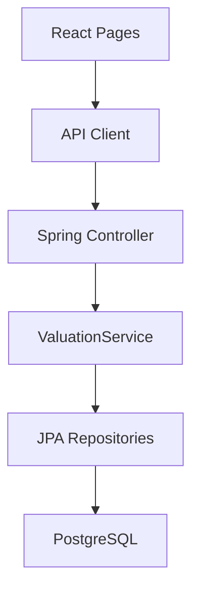

# Systemdokumentation 1: ValuPilot DMS

Stand: 05.08.2026  
Docker-Web: `http://localhost:15173`  
Docker-API: `http://localhost:18080`

## AI-Assisted Documentation and Co-Development Statement

Diese Systemdokumentation wurde mit Unterstützung von OpenAI Codex (Codex AI) erstellt. Das dazugehörige DMS-Codeprojekt wurde in einem KI-gestützten Co-Development-Prozess konzipiert, analysiert, strukturiert und mitentwickelt. Codex unterstützte insbesondere bei technischer Dokumentationsstruktur, Codeanalyse, Docker-/GitHub-Aufbereitung und branchspezifischer Organisation. Fachliche Zielsetzung, Projektausrichtung, Auswahlentscheidungen, Prüfung und finale Verantwortung liegen beim Projektverfasser Lazar Minkov.

## 1. Kurzbeschreibung

ValuPilot DMS ist ein fokussierter DMS-Prototyp für Fahrzeugdaten und Fahrzeugbewertung. Das System untersucht, wie Fahrzeug-, Service-, Hersteller- und Marktdaten genutzt werden können, um einen nachvollziehbaren Preisvorschlag zu erzeugen.

Der wichtigste Unterschied zu einer einfachen Fahrzeugverwaltung ist die Bewertungslogik: Das System speichert nicht nur Fahrzeuge, sondern versucht eine begründete Bewertung abzuleiten. Damit eignet sich ValuPilot als technischer Kern für ein akademisches Projekt, das Datenbasis und Entscheidungslogik miteinander verbindet.

## 2. Fachlicher Zweck

ValuPilot beantwortet im Kern die Frage:

Wie kann ein kleines Autohaus Fahrzeugdaten so erfassen, dass daraus ein nachvollziehbarer Bewertungsprozess entsteht?

Das System konzentriert sich auf:

- Kunden
- Fahrzeuge
- Serviceeinträge
- Herstellerprotokolle
- Marktreferenzen
- Fahrzeugbewertungen
- Preisvorschläge mit Erklärung

## 3. Technologiestack

| Bereich | Technologie | Version / Hinweis |
| --- | --- | --- |
| Backend | Spring Boot | `3.3.5` |
| Backend-Sprache | Java | `21` |
| Persistenz | Spring Data JPA | Repository-Abstraktion |
| Validierung | Spring Boot Validation | Eingabevalidierung |
| Datenbank | PostgreSQL | Docker-Service `valupilot-db` |
| Testdatenbank | H2 | Test-Scope |
| Frontend | React | `19.0.0` |
| Frontend-Sprache | TypeScript | `5.7.2` |
| Build Tool | Vite | `6.0.5` |
| Icons | lucide-react | `0.468.0` |
| Container | Docker, nginx, Node 22, Maven, Temurin 21 | Multi-Stage-Build |

## 4. Warum diese Technologien hier passen

Spring Boot passt zu ValuPilot, weil Bewertungslogik, Datenzugriff und API sauber getrennt werden müssen. Die Bewertungsfunktion benötigt mehrere Datenquellen: Fahrzeug, Marktreferenz, Servicehistorie und Herstellerprotokoll. Ein Backend mit Services und Repositories macht diese Logik nachvollziehbar.

React passt, weil die Bewertung nicht nur als Zahl gezeigt werden sollte. Die Oberfläche kann positive Faktoren, negative Faktoren, Warnungen und Confidence Score getrennt darstellen. Dadurch entsteht eine erklärbare Benutzeroberfläche statt einer reinen Ergebnisanzeige.

PostgreSQL passt, weil Fahrzeugbewertung relational arbeitet: Ein Fahrzeug kann Serviceeinträge und Bewertungen besitzen; Marktreferenzen beziehen sich auf Hersteller, Modell und Jahr; Kunden sind mit Fahrzeugen verknüpft.

## 5. Technische Struktur

Backend-Struktur:

```text
src/main/java/com/example/dms/
  controller/
  dto/
  entity/
  repository/
  service/
  exception/
  config/
```

Frontend-Struktur:

```text
frontend/src/
  api/client.ts
  components/
  pages/
  types/domain.ts
  App.tsx
  styles.css
```

Die Struktur folgt einem einfachen Schichtenmodell:



## 6. Datenmodell

Die wichtigsten Entitäten sind:

| Entität | Zweck |
| --- | --- |
| `Customer` | Kundendaten |
| `Vehicle` | Fahrzeugdaten wie VIN, Marke, Modell, Jahr, Kilometerstand, Preis |
| `ServiceRecord` | Wartungs- und Servicehistorie |
| `ManufacturerProtocol` | Hersteller- und Modellinformationen |
| `MarketReference` | Vergleichsdaten aus dem Markt |
| `VehicleValuation` | gespeicherte Bewertung eines Fahrzeugs |

Die Datenstruktur ist bewusst klein genug für einen Prototyp, aber fachlich aussagekräftig genug für eine Bewertungsdemo.

## 7. API-Oberfläche

ValuPilot stellt REST-Endpunkte unter `/api` bereit.

| Ressource | Pfad | Methoden |
| --- | --- | --- |
| Kunden | `/api/customers` | `GET`, `GET /{id}`, `POST` |
| Fahrzeuge | `/api/vehicles` | `GET`, `GET /{id}`, `POST`, `PUT /{id}` |
| Serviceeinträge | `/api/service-records` | `GET`, `GET /{id}`, `POST` |
| Herstellerprotokolle | `/api/manufacturer-protocols` | `GET`, `GET /{id}`, `POST` |
| Marktreferenzen | `/api/market-references` | `GET`, `GET /{id}`, `POST` |
| Bewertungen | `/api/vehicle-valuations` | `GET`, `GET /{id}`, `POST` |
| Bewertungsvorschlag | `/api/vehicle-valuations/suggest` | `POST` |

## 8. Bewertungslogik

Die zentrale Fachlogik liegt in `ValuationService.java`.

Der Bewertungsprozess lässt sich als Rezept beschreiben:

1. Fahrzeug per ID laden.
2. Fehlende Fahrzeugdaten sammeln, z. B. fehlende VIN, Marke, Modell oder Kilometerstand.
3. Passendes Herstellerprotokoll suchen.
4. Servicehistorie des Fahrzeugs laden.
5. Marktreferenzen nach Hersteller und Modell suchen.
6. Basispreis bestimmen.
7. Kilometerstand gegenüber Benchmark bewerten.
8. Servicehistorie positiv oder negativ berücksichtigen.
9. Asking Price als zusätzliches Signal verwenden.
10. Preis auf sinnvolle Rundung bringen.
11. Confidence Score berechnen.
12. Erklärungstext, positive Faktoren, negative Faktoren und Warnungen zurückgeben.

Das ist kein vollautomatisches professionelles Bewertungssystem, sondern ein erklärbarer Prototyp. Genau das ist für ein Diplomprojekt sinnvoll: Die Logik ist nachvollziehbar und erweiterbar.

## 9. Docker-Verwaltung

ValuPilot besteht im Docker-Setup aus drei Services:

| Service | Container | Zweck |
| --- | --- | --- |
| `valupilot-db` | `valupilot-dms-db` | PostgreSQL 16 |
| `valupilot-api` | `valupilot-dms-api` | Spring Boot API |
| `valupilot-web` | `valupilot-dms-web` | React-Frontend über nginx |

Ports:

| Dienst | Host-Port | Container-Port |
| --- | ---: | ---: |
| Web | 15173 | 80 |
| API | 18080 | 8080 |
| PostgreSQL | 55432 | 5432 |

Die API wartet über `depends_on` auf den Healthcheck der Datenbank. Das ist wichtig, weil Spring Boot beim Start eine Datenbankverbindung benötigt. Ohne Healthcheck kann die API starten, bevor PostgreSQL bereit ist.

Start:

```bash
cd /Users/lazarminkov/Documents/DMS_System_DEMO/dealer-management-systems
docker compose up -d valupilot-web
```

## 10. Designrichtung

ValuPilot nutzt ein ruhiges, helles Interface mit dunkler grüner Sidebar und warmem Akzent. Diese Designrichtung passt zum Bewertungsfokus, weil die Oberfläche Vertrauen und Konzentration erzeugen soll.

Designmerkmale:

- helle Arbeitsfläche
- dunkle Sidebar
- reduzierte Karten und Panels
- klare Metriken
- Tabellen und Statusanzeigen
- Icons als Orientierungshilfe

Begründung:

Eine Fahrzeugbewertung braucht Transparenz. Benutzer sollen erkennen, warum ein Preis vorgeschlagen wird. Deshalb sollte das Design nicht spielerisch wirken, sondern sachlich, ruhig und prüfbar.

## 11. Vorteile und Nachteile des Systems

Vorteile:

- klarer fachlicher Fokus auf Fahrzeugbewertung
- kleine, gut erklärbare Backend-Struktur
- nachvollziehbare Bewertungslogik
- geeignet für Forschung und Prototyping
- Docker-Betrieb mit eigener Datenbank

Nachteile:

- noch kein vollständiges DMS
- keine produktionsreife Benutzer- und Rechteverwaltung
- Bewertungslogik basiert auf internen Referenzen und Heuristiken, nicht auf echtem Markt-API-Datenstrom
- Frontend ist bewusst schmaler als bei DealerOps

## 12. Aufbauanleitung für Studierende

Wer ein ähnliches System entwickeln möchte, kann so vorgehen:

1. Zuerst die wichtigsten Bewertungsdaten definieren: Fahrzeug, Marktvergleich, Kilometerstand, Servicehistorie.
2. Daraus JPA-Entities erstellen.
3. Pro Entity ein Repository anlegen.
4. Pro Ressource einen REST-Controller erstellen.
5. Bewertungslogik in einen Service auslagern.
6. Bewertungsergebnis nicht nur als Preis, sondern mit Erklärung zurückgeben.
7. Frontend-Seiten für Dashboard, Fahrzeuge, Bewertung und Protokolle bauen.
8. Docker Compose mit API, Web und PostgreSQL einrichten.
9. Testdaten einfügen.
10. Bewertungslogik mit realistischen Fällen prüfen.

## 13. Geeignete Weiterentwicklung

- echte Marktdatenquelle ergänzen
- OpenAPI-Dokumentation erzeugen
- Benutzerrollen ergänzen
- Bewertungslogik mit Gewichtungen konfigurierbar machen
- Datenqualität visuell stärker darstellen
- Nutzertest mit fachnahen Personen durchführen

## 14. Quellen

React Documentation. 2026. *Quick Start / Learn React*. https://react.dev/learn  
Vite Documentation. 2026. *Getting Started*. https://vite.dev/guide/  
Spring. 2026. *Spring Boot Documentation*. https://docs.spring.io/spring-boot/index.html  
Spring Data. 2026. *Spring Data JPA Reference*. https://docs.spring.io/spring-data/jpa/reference/  
PostgreSQL Global Development Group. 2026. *PostgreSQL Documentation*. https://www.postgresql.org/docs/current/tutorial.html  
Docker. 2026. *Docker Compose Documentation*. https://docs.docker.com/compose/  
Nielsen, J. 1994/2024. *10 Usability Heuristics for User Interface Design*. https://www.nngroup.com/articles/ten-usability-heuristics/
